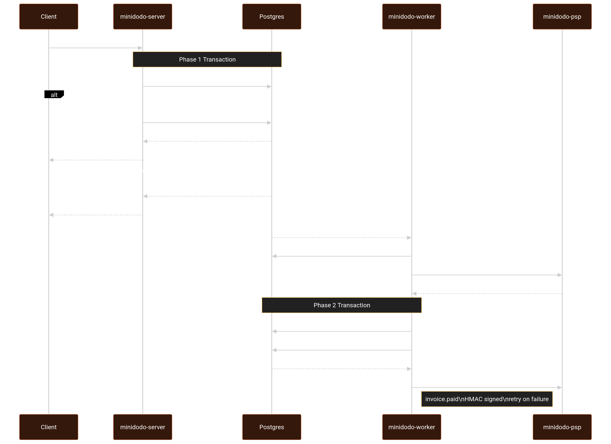

# minidodo

A minimal Invoice & Payment Service in Rust. Businesses create invoices for customers,
customers pay them through a mock payment processor, and businesses receive signed webhooks
for payment state changes.

Built with Axum, sqlx, and Postgres. See `DESIGN.md` for the architecture, data model, state
machine, and failure handling.

## Services

`docker compose up` runs four services:

- **server** (`:3000`): the invoice and payment HTTP API.
- **psp** (`:8080`): the mock payment processor, and a webhook sink that verifies signatures.
- **worker**: completes payments (drives the PSP charge and settlement) and delivers webhooks.
- **postgres**: the database. Migrations run on startup before the other services.

The payment API returns `202` immediately and never blocks on the PSP. The worker performs the
charge asynchronously, driven by `LISTEN/NOTIFY` with a recovery sweep as a crash backstop.

## End-to-End Payment Sequence


## Requirements

- Docker and Docker Compose

## Run

```sh
docker compose up
```

This brings up the API server, Postgres, the mock PSP, and the worker with no manual steps.
Migrations run automatically before the services start.

## Curl examples

The default development API key seeded during migration for `Acme Corp` is:

```sh
export API_KEY="dodo_test_key_12345"
export BASE="http://localhost:3000"
```

Create a customer (a seeded `Ada Lovelace` customer also exists):

```sh
curl -s -X POST "$BASE/v1/customers" \
  -H "authorization: Bearer $API_KEY" \
  -H "content-type: application/json" \
  -d '{"name": "Ada Lovelace", "email": "ada@example.com"}'
```

Create an invoice (the server computes the total from line items, never trusts a client
total). Copy the `customer_id` from the response above into `CUSTOMER_ID`:

```sh
export CUSTOMER_ID="<customer-id>"
curl -s -X POST "$BASE/v1/invoices" \
  -H "authorization: Bearer $API_KEY" \
  -H "content-type: application/json" \
  -d "{
    \"customer_id\": \"$CUSTOMER_ID\",
    \"due_date\": \"2026-12-31\",
    \"line_items\": [
      {\"description\": \"Consulting\", \"quantity\": 2, \"unit_amount_cents\": 15000}
    ]
  }"
```

Finalize the invoice (`draft -> open`) so it can be paid. Copy the invoice `id` into
`INVOICE_ID`:

```sh
export INVOICE_ID="<invoice-id>"
curl -s -X PATCH "$BASE/v1/invoices/$INVOICE_ID" \
  -H "authorization: Bearer $API_KEY" \
  -H "content-type: application/json" \
  -d '{"state": "open"}'
```

Pay the invoice (success). The response is `202 Accepted`; the worker settles it to `paid`
shortly after:

```sh
curl -s -X POST "$BASE/v1/invoices/$INVOICE_ID/pay" \
  -H "authorization: Bearer $API_KEY" \
  -H "idempotency-key: $(uuidgen)" \
  -H "content-type: application/json" \
  -d '{"card_token": "tok_success"}'
```

Pay a different invoice (failure). A declined card returns the invoice to `open`, never
corrupting its state:

```sh
curl -s -X POST "$BASE/v1/invoices/$INVOICE_ID/pay" \
  -H "authorization: Bearer $API_KEY" \
  -H "idempotency-key: $(uuidgen)" \
  -H "content-type: application/json" \
  -d '{"card_token": "tok_card_declined"}'
```

### Mock PSP card tokens

The mock PSP selects an outcome from the `card_token`:

| Token | Behavior |
|-------|----------|
| `tok_success` | Succeeds (invoice becomes `paid`) |
| `tok_card_declined` | Definitive failure (invoice returns to `open`) |
| `tok_insufficient_funds` | Definitive failure (invoice returns to `open`) |
| `tok_network_error` | Upstream 500, treated as a definitive failure |
| `tok_timeout` | Sleeps ~30s then succeeds; the API never blocks on it |

## API documentation

The OpenAPI 3.1 spec is committed at [`openapi/openapi.json`](openapi/openapi.json).

When the server is running it is also served live:

- Swagger UI: `http://localhost:3000/swagger-ui`
- Raw spec: `http://localhost:3000/api-docs/openapi.json`

Regenerate the committed copy from a running stack with:

```
curl -s http://localhost:3000/api-docs/openapi.json | python3 -m json.tool > openapi/openapi.json
```

## Tests

Integration tests run against a live stack and cover auth, customers, invoices and the state
machine, idempotent payments, PSP failure modes, concurrency with no double charge, and signed
webhook delivery. See [`tests/README.md`](tests/README.md).

```sh
docker compose up -d
cargo test --manifest-path tests/integration/Cargo.toml
```

## Demo Video

TODO: add link before submission.
